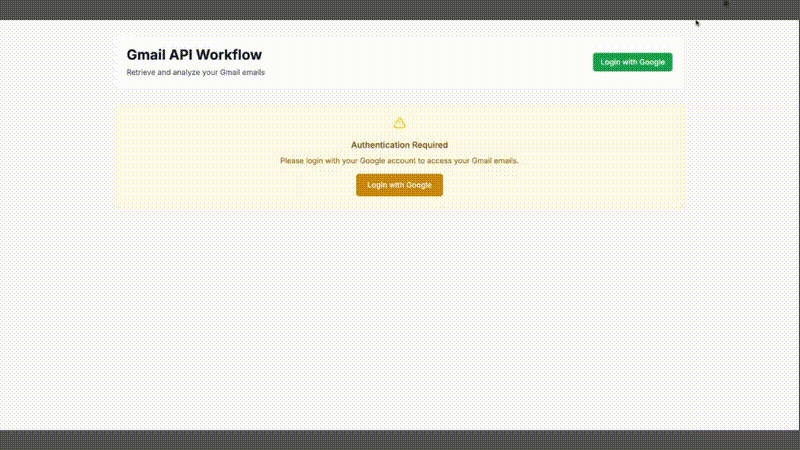

# Gmail Information Tagging Project

A comprehensive Gmail API workflow for email retrieval and analysis, with both Python and Next.js implementations.

## 🎥 **Demo**



*Watch the demo above to see the AI-powered email organization and task management features in action!*

## 🚀 **Application**

The **recommended and working solution** is the Next.js application located in `nextjs-gmail-workflow/`.

### Quick Start (Recommended)
```bash
cd nextjs-gmail-workflow
npm install
npm run dev
```
**Access**: http://localhost:3000

### Features
- ✅ **Modern Web UI** with Tailwind CSS
- ✅ **Google OAuth2 Authentication**
- ✅ **Gmail API Integration**
- ✅ **Real-time Email Retrieval**
- ✅ **Responsive Design**
- ✅ **Secure Token Handling**

---

## 📁 **Project Structure**

### **Primary Solution (Working)**
- `nextjs-gmail-workflow/` - **Next.js 14+ application** ⭐ **RECOMMENDED**

### **Alternative Solutions (Python)**
- `gmail_workflow.py` - Original Python implementation
- `gmail_workflow_simple.py` - Simplified Python version
- `gmail_workflow_fixed.py` - Fixed port Python version

### **Configuration & Setup**
- `config/` - Gmail API configuration files
- `setup_gmail_credentials.py` - Credential setup script
- `gmail_config_manager.py` - Configuration management

### **Documentation**
- `GMAIL_API_WORKFLOW_GUIDE.md` - Comprehensive workflow guide
- `TASK_BREAKDOWN_GMAIL_API.md` - Project task breakdown
- `END_TO_END_TEST_RESULTS.md` - Testing results

---

## 🎯 **Which Solution to Use**

### **For Web Application (Recommended)**
Use the **Next.js application** in `nextjs-gmail-workflow/`:
- Modern web interface
- OAuth2 authentication
- Real-time email retrieval
- Production-ready

### **For Command Line**
Use the Python scripts:
- `gmail_workflow.py` - Full-featured version
- `gmail_workflow_simple.py` - Simplified version
- `gmail_workflow_fixed.py` - Fixed authentication issues

---

## 🔧 **Setup Requirements**

### **Google Cloud Console Setup**
1. Enable Gmail API in your Google Cloud project
2. Configure OAuth2 credentials
3. Set up redirect URIs for web application

### **Environment Configuration**
- Copy `.env.example` to `.env` (for Python)
- Configure `nextjs-gmail-workflow/.env` (for Next.js)

---

## 📊 **Current Status**

| Component | Status | Notes |
|-----------|--------|-------|
| Next.js App | ✅ **Working** | Primary solution |
| Python Scripts | ✅ Available | Alternative CLI option |
| Gmail API | ✅ Enabled | Required for all solutions |
| OAuth2 | ✅ Configured | Working authentication |

---

## 🚨 **Important Notes**

1. **Gmail API must be enabled** in Google Cloud Console
2. **OAuth2 credentials** must be properly configured
3. **Next.js solution** is the recommended approach
4. **Python scripts** are available for CLI usage

---

## 📚 **Documentation**

- `GMAIL_API_WORKFLOW_GUIDE.md` - Complete workflow documentation
- `TASK_BREAKDOWN_GMAIL_API.md` - Project management breakdown
- `nextjs-gmail-workflow/README.md` - Next.js specific documentation

---

**Last Updated**: July 2025  
**Primary Solution**: Next.js Application  
**Status**: ✅ Fully Functional 
